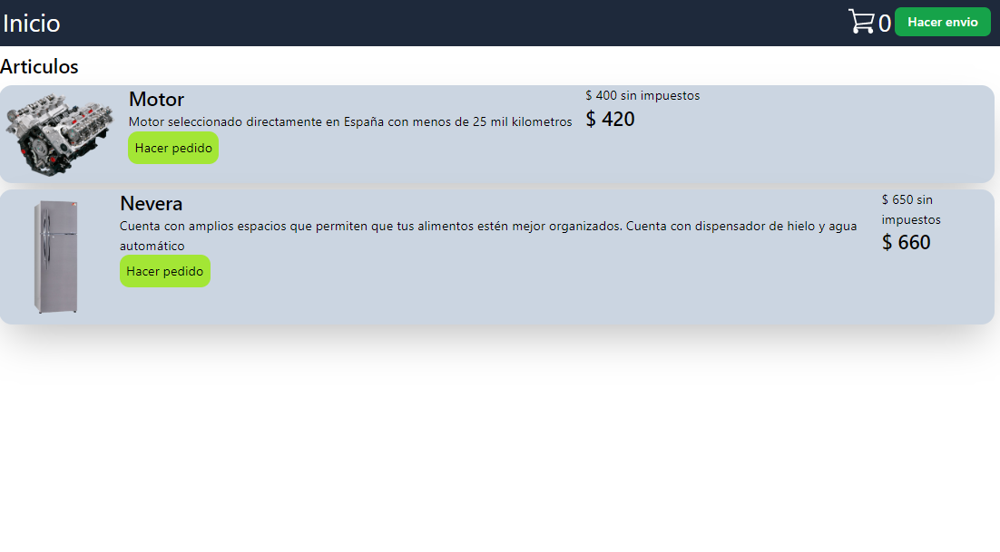

# Prueba tecnica

Prueba tecnica de Centribal: Se trata de una sistema simple de envios que usa React y Json-server

## Instalacion

1. Instalar los modulos con `npm install`
2. Iniciar el server de Json con `npm run json`
3. Iniciar el servidor de la app con `npm run dev`
4. Acceder al puerto local que aparezca en la terminal

## Screenshots

